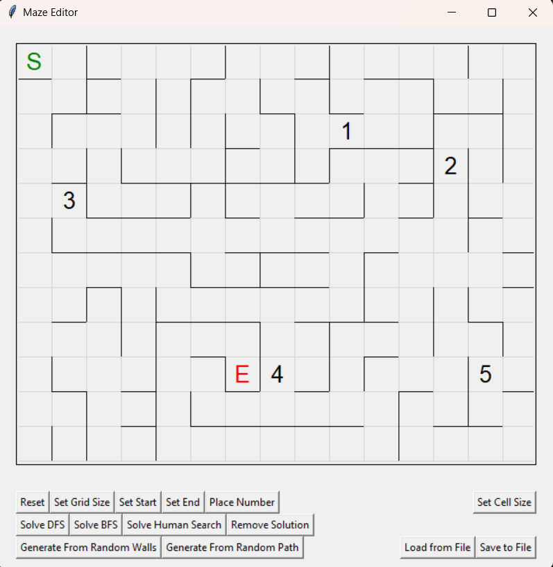

# Numbered Maze Solver/Creator - Assignments 1 and 2 for CSCI 539

This repo contains my code for assignments 1 and 2 in CSCI 539 - Maze Solver/Creator


<div style="max-width: 400px;">
    
</div>

## Numbered Maze

The type of maze that this program works with is a special type of maze where some cells are numbered. Before you reach the end of the maze you must pass through every one of the numbers in order, starting at 1 and going up to whatever is the last number.


## Functions

This program allows you to create/edit a numbered maze and save that maze to a file, will solve those mazes and draw the solution, and can also generate a new random maze based on a difficulty score from 1-3. 


### User-Based Editing

To edit a maze, the program has the ability to:

- Turn cell walls on or off
- Highlight cells
    - Set cell as start or end
    - Place number into cell


### Solving

The program has the ability to solve a maze using either BFS or DFS, as well as "Human Search", which is a slightly altered version of DFS. 


### Generating

The program has the ability to generate a new random maze from a given difficulty score from 1-3.


## How to run

To run this code, launch guiAkariCreator.py like

```bash
python3 guiMazeCreator.py -f fun_4_1
```

-f is an option you can use to load up a file on launch, it only looks in the /mazes folder for files