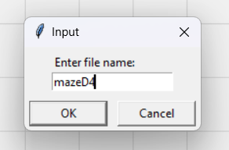
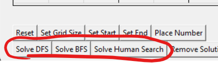
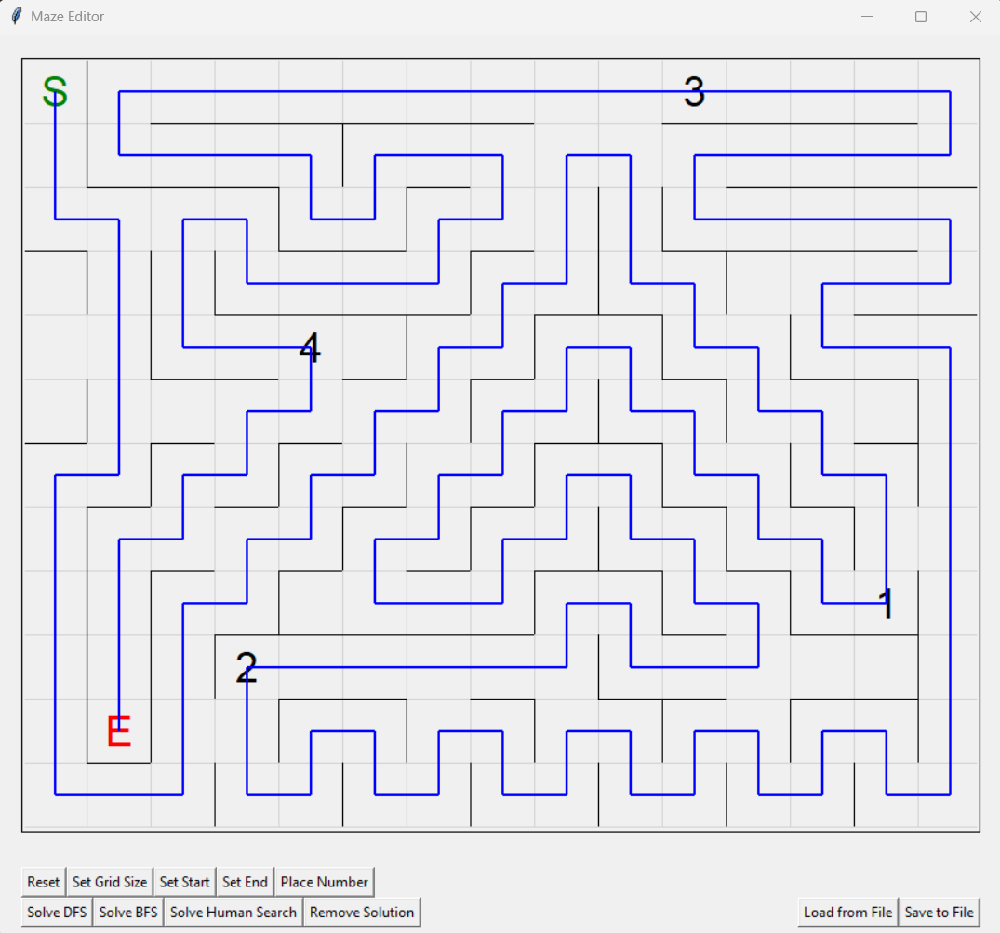

# Steven Wells HW 2: Maze solver

## Type of Maze

For this assignment, I chose the number-maze; the type of maze where it is very similar to your average maze, but with some numbered cells. To solve the maze, you need to pass through every one of the numbered cells in order before you reach the end square.

## Files in Submission

This submission contains two python files: 'maze.py' and 'guiMazeCreator.py'. 

### maze.py

'maze.py' is the file that contains the classes and logic for processing mazes, solving mazes, and loading mazes from/storing mazes to files. To view the logic of the three different solving algorithms, you would need to look at the corresponding functions in this file: 'solve_dfs', 'solve_bfs', and 'solve_human_search'.

### guiMazeCreator.py

'guiMazeCreator.py' is a python tkinter gui application that allows one to create their own mazes of this kind, as well as load up existing maze files and use the solver algorithms on these mazes. It will also draw the solution lines found by the solving algorithms right on top of the maze inside the editor.

### Saved maze files

The last type of file you will find in this submission are the maze files themselves. They have no extensions and are all stored inside the 'mazes' folder. 

## Loading mazes

When you are loading one of these mazes, you have two options to do so. One option is to launch the gui program with 
```
py guiMazeCreator.py
```
and then hit the 'Load from file' button, and then enter the maze file's name. For instance, to load mazeD3-Sun, you would just type 'mazeD3-Sun' into this box:


 
You can also load mazes by passing them as an argument when launching the guiMazeCreator. For instance, to load 'mazeD3-Sun', you would launch the guiMazeCreator.py program like this:
```
py guiMazeCreator.py -f mazeD3-Sun
```

## Using solver algorithms

Once you have a maze loaded in the gui editor that is valid (has a start and end, and possibly has numbers), you can hit any of the solver buttons:



doing so will activate the correlating solver algorithm (located in maze.py), and then will pass the solution it has found back to the gui program, which will draw that solution with a blue line, like this:



## Included maze files

Included are several maze files:

- maze00

this is the maze that was included in the packet we received on the day we went over many different maze types. I thought I would include it because it was the first maze that I tested my solving algorithms on

- mazeD1
- mazeD2
- mazeD3
- mazeD4
- mazeS1
- mazeS2

the rest of these mazes are ones that I have created, the ones like 'mazeD' are bigger mazes in 15x12 space, and the ones like 'mazeS' are smaller mazes, one of which is 7x7 and the other is 8x8

## Solving algorithms

In maze.py, there are three solving algorithms that are part of the Maze class: 'solve_dfs', 'solve_bfs', and 'solve_human_search'.

### solve_dfs and solve_bfs

solve_dfs and solve_bfs are basic DFS and BFS solving algorithms, although they were slightly difficult to implement, as a few modifications were necessary to make them work with the type of maze that I chose for this project. 

For example, solve_dfs keeps track of the entire traversed path, and whenever it cannot add any new legal_neighbors to the stack, it deletes cells off the traversed path until it has backtracked to the cell from which the next cell in the stack came from. 

And BFS needs to keep track of the traversed cells for each path it is checking, so it keeps a list of all the solutions that it is trying in each iteration.

### solve_human_search

solve_human_search is very similar to solve_dfs, with one change. I changed the algorithm so that instead of adding each of the legal_neighbors to the stack in the same order every time, the algorithm rates each of those neighbors based on how close it is to the next cell we are trying to get to, and will always add them to the stack in the order of closest cell to farthest cell. 

So, if the last number we have passed is a 1, and there is a 2 cell in the maze, whenever we have multiple legal neighbors, we look at how close each of those neighbors is to the 2 cell, and we add the neighbors in order of how close they are to the 2 cell.

My thought process here was that whenever I am solving a maze like this, when I make a turn I try to go in the direction of the next numbered cell that I need. So if the most recent number I touched was 1, I will make my turns to try to get to the number 2. That is the modification I made to my solve_dfs method in order to make it more human-like. 

Changing the algorithm like this has some interesting results - I added functionality to record the number of iterations